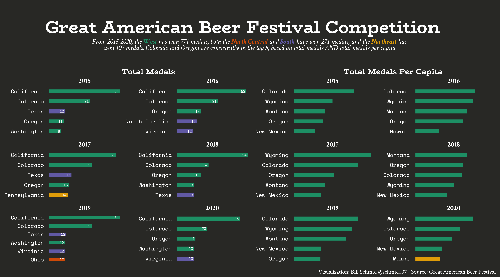

# TidyTuesday - Weekly Data Viz Challenge in R
This repository contains code used for [#TidyTuesday](https://github.com/rfordatascience/tidytuesday) visualizations.  TidyTuesday is a weekly data challenge which places an emphasis on summarizing and arranging data to make meaningful charts using `ggplot2`, `tidyr`, `dplyr`, and other tools in the `tidyverse` ecosystem. A list of visualisations is provided below:

## 11/03/2020 Week 45 🛋️ IKEA [(code)](https://github.com/schmid07/TidyTuesday/blob/main/Code/ikea.r)

## 10/20/2020 Week 43 🍻 Beer [(code)](https://github.com/schmid07/TidyTuesday/blob/main/Code/beer.r)

## 10/06/2020 Week 41 🏀 Women's College Basketball [(code)](https://github.com/schmid07/TidyTuesday/blob/main/Code/women_bball.R)

