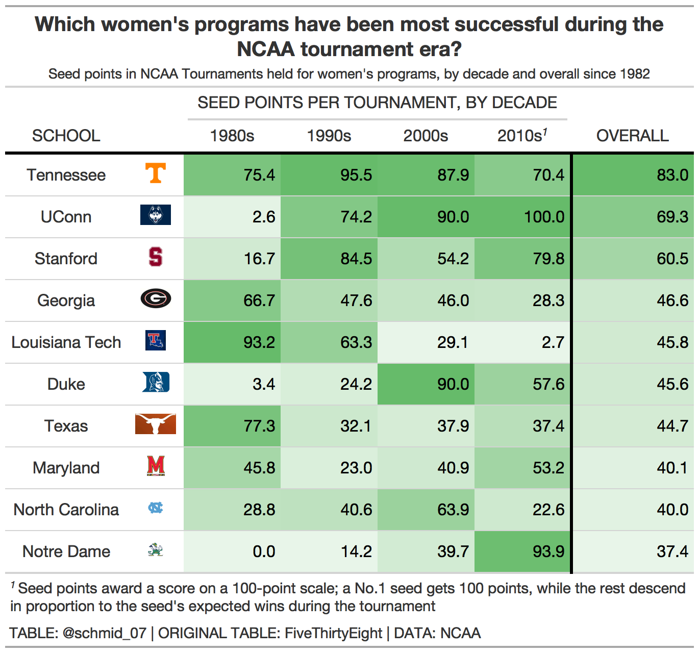
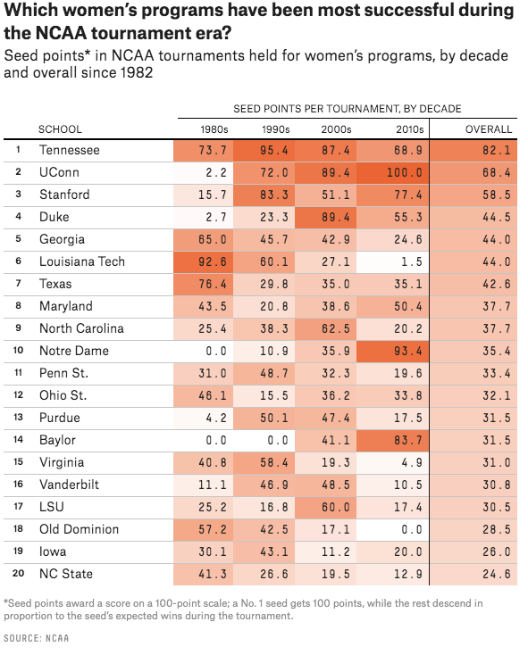

# TidyTuesday - Weekly Data Viz Challenge in R
This repository contains code used for [#TidyTuesday](https://github.com/rfordatascience/tidytuesday) visualizations.  TidyTuesday is a weekly data challenge which which places an emphasis on summarizing and arranging data to make meaningful charts using `ggplot2`, `tidyr`, `dplyr`, and other tools in the `tidyverse` ecosystem. A list of visualisations is provided below:
https://github.com/rfordatascience/tidytuesday/blob/master/data/2020/2020-10-06/readme.md

original:
https://fivethirtyeight.com/features/louisiana-tech-was-the-uconn-of-the-80s/

