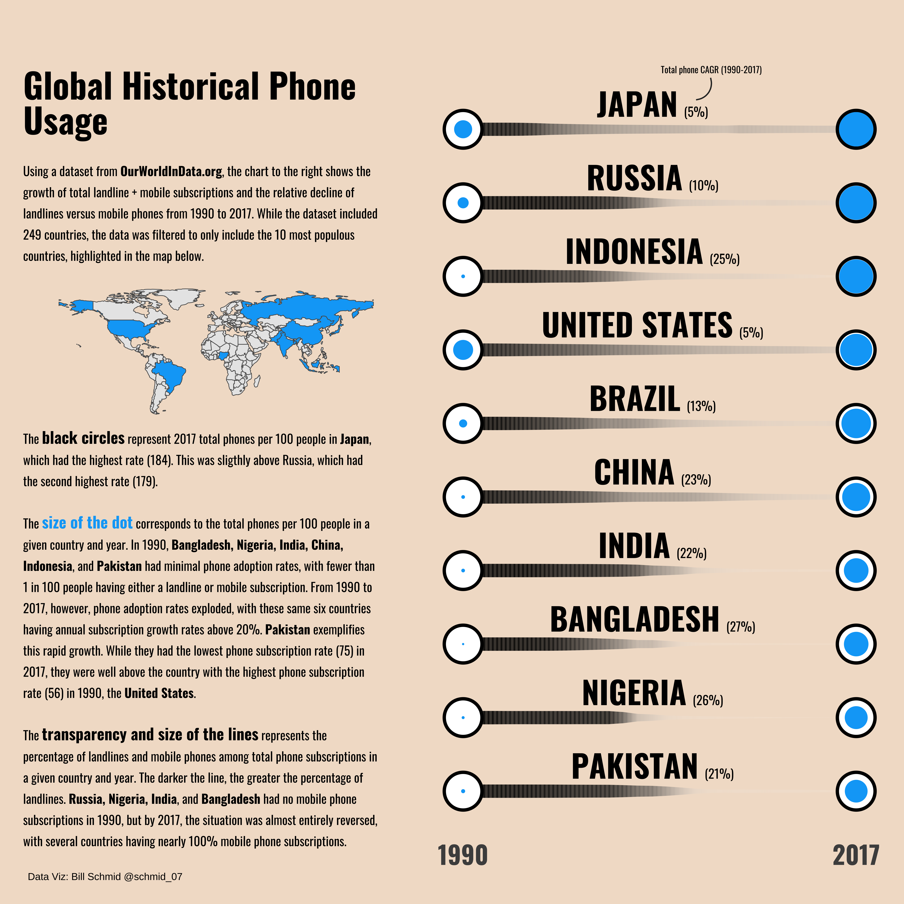
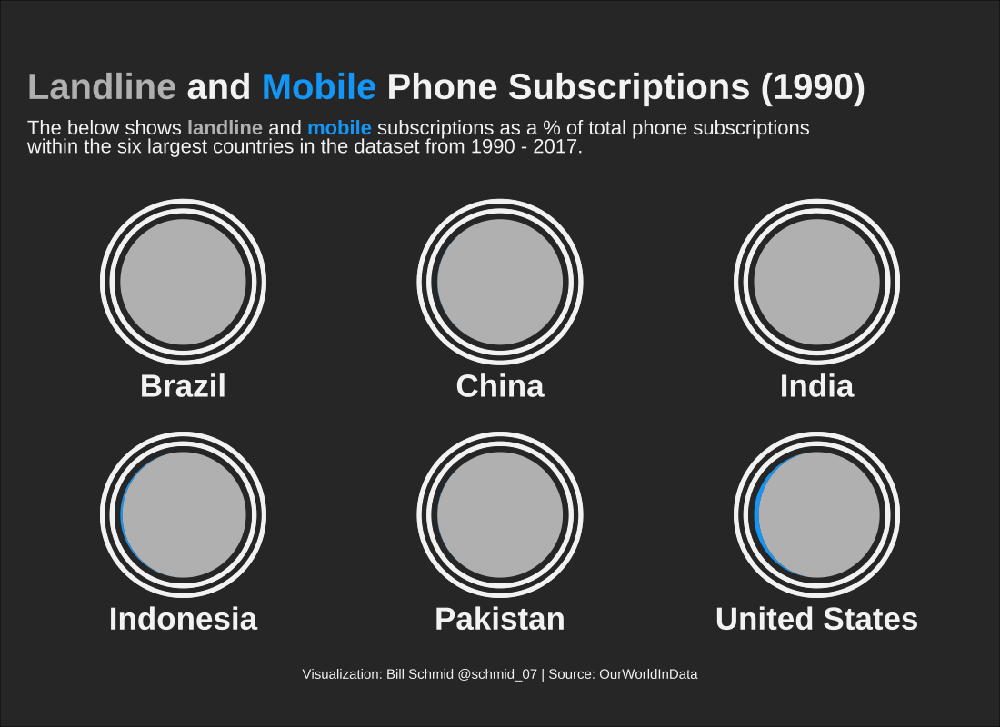
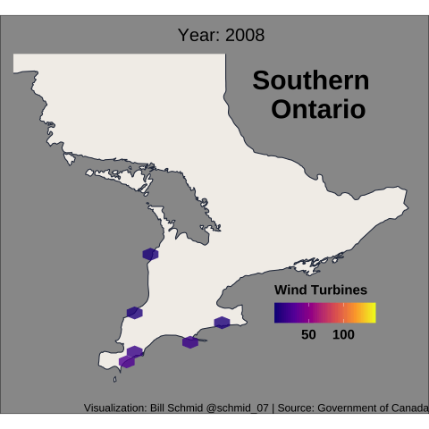
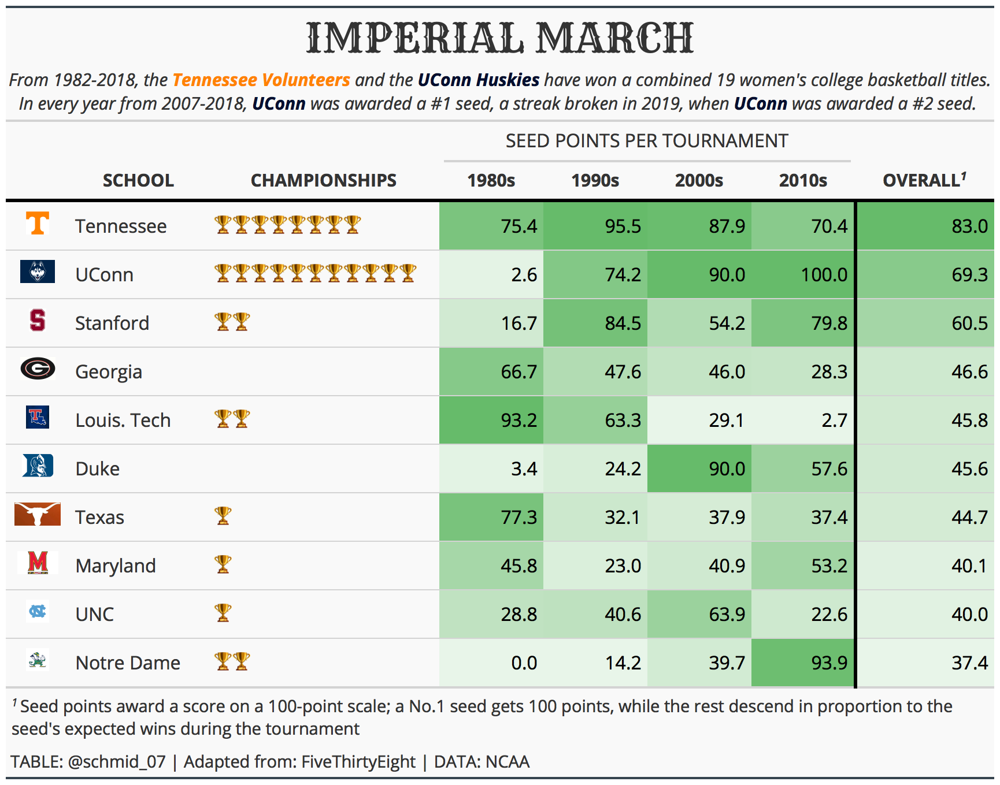

# TidyTuesday - Weekly Data Viz Challenge in R
This repository contains code used for [#TidyTuesday](https://github.com/rfordatascience/tidytuesday) visualizations.  TidyTuesday is a weekly data challenge which places an emphasis on summarizing and arranging data to make meaningful charts using `ggplot2`, `tidyr`, `dplyr`, and other tools in the `tidyverse` ecosystem. A list of visualisations is provided below:

## 12/01/2020 Week 49 🏠 Toronto Shelters [(Code)](https://github.com/schmid07/TidyTuesday/blob/main/Code/2020_49_tor_shelters.Rmd)

## 11/10/2020 Week 46 📞 📱 Landline and Mobile Phone Subscriptions [(Code_1)](https://github.com/schmid07/TidyTuesday/blob/main/Code/2020_46_static_phones.Rmd) [(Code_2)](https://github.com/schmid07/TidyTuesday/blob/main/Code/2020_46_phones.Rmd) 

## 11/03/2020 Week 45 🛋️ IKEA [(code)](https://github.com/schmid07/TidyTuesday/blob/main/Code/ikea1.r)

## 10/27/2020 Week 44 🇨🇦 💨 Canadian Wind Turbines
[(Code)](https://github.com/schmid07/TidyTuesday/blob/main/Code/2020_44_wind_turbines.Rmd)

## 10/20/2020 Week 43 🍻 Beer
[(Code)](https://github.com/schmid07/TidyTuesday/blob/main/Code/beer.r)

## 10/06/2020 Week 41 🏀 Women's College Basketball 
[(Code)](https://github.com/schmid07/TidyTuesday/blob/main/Code/2020_41_bball.R)

