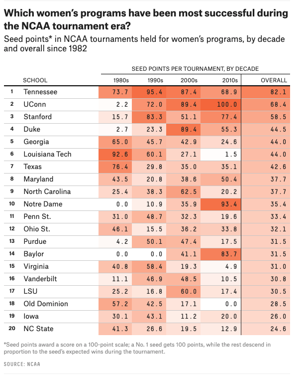

## 10/06/2020 Week 41 🏀 Women's College Basketball 
[(**Code**)](https://github.com/schmid07/TidyTuesday/blob/main/Code/2020_41_bball.R)

The below plot was adapted from a chart in Neil Paine's [FiveThirtyEight](https://fivethirtyeight.com/) [article](https://fivethirtyeight.com/features/louisiana-tech-was-the-uconn-of-the-80s/) on women's college basketball dynasties. 

### Original FiveThirtyEight Chart

